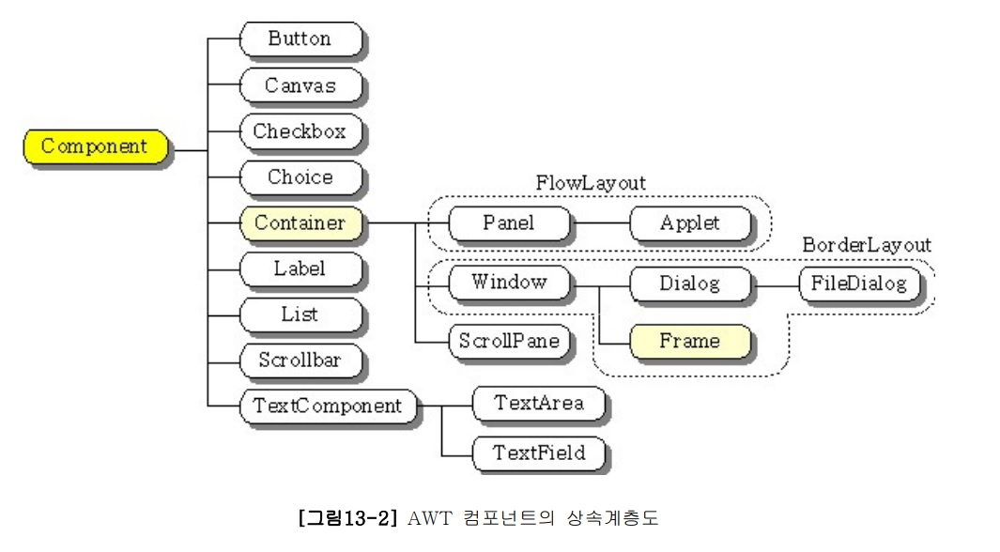

---

## <a href = "../../README.md" target="_blank">AWT와 애플릿 (AWT & Applet)</a>

### 1. AWT
#### 1.2 AWT의 구성

1. AWT 관련 패키지들
2. 일반 컴포넌트
3. 메뉴 관련 컴포넌트

---

# 1.2 AWT의 구성

## 1) AWT 관련 패키지들
1. **java.awt**
   - AWT를 이용한 GUI 어플리케이션을 작성하는데 필요한 기본적인 클래스, 컴포넌트 제공
2. java.awt.datatransfer
3. java.awt.dnd
4. **java.awt.event**
   - GUI 어플리케이션에서 발생하는 이벤트를 처리하는데 필요한 클래스, 인터페이스 제공
5. java.awt.font
6. java.awt.image
7. java.awt.print

---

## 2) 일반 컴포넌트 : Component 클래스와 그 하위 클래스들
- Button, Label, Checkbox, List, Choice, Scrollbar, Dialog, Frame, TextArea와 TextField, FileDialog

---

## 3) 메뉴 관련 컴포넌트 : MenuComponent 클래스와 그 하위 클래스들
- MenuBar, MenuItem, Menu, CheckboxMenuItem, ...
