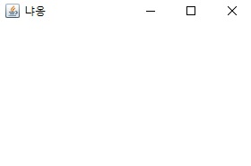

## <a href = "../../README.md" target="_blank">AWT와 애플릿 (AWT & Applet)</a>

### 2. AWT의 주요 컴포넌트
#### 2.1 Frame
1. Frame
2. Frame의 메서드들

---

# 2.1 Frame

## 1) Frame
- 다른 컴포넌트들을 포함할 수 있는 컨테이너
- titlebar, 최대화 버튼, 최소화 버튼, 닫기 버튼이 있으며 크기 조절 가능

## 2) Frame의 메서드들
1. 생성자
   - Frame(String title) : Frame 생성. Frame의 titlebar에 보여질 text
2. titleBar의 text
   - String getTitle() : titlebar에 있는 text를 얻어옴
   - void setTitle(String title) : titlebar의 text 변경
3. Frame의 상태
   - void setState(int state) : Frame의 상태 변경. state에는 아래의 두가지 값 중 하나만을 사용할 수 있다.
     - Frame.ICONIFIED : Frame을 최소화 상태가 되게 한다.
     - Frame.NORMAL : Frame을 정상적인 상태(최소화 이전 상태)가 되게 한다.
   - int getState() : Frame의 현재 상태를 알 수 있다.
4. Frame의 크기
   - void setResizable(boolean resizable) : Frame의 크기를 변경 가능(ture) 또는 변경 불가능(false)하게 한다.

---

## \[예제\]

### 예제 1>
```
import java.awt.*;

public class FrameTest {
    public static void main(String[] args) {
        Frame frame = new Frame("냐옹"); // Title의 text가 "냐옹"인 Frame을 생성한다.
        frame.setSize(300, 200); // 컴포넌트의 size를 지정한다.
        frame.setVisible(true); // 컴포넌트가 화면에 보이게(true) 한다.
    }
}
```

- AWT는 native Component 기반의 컴포넌트를 제공하므로, 실행한 OS의 window와 동일한 외향을 출력해준다.
- 크기 조절 가능, title bar를 드래그하면 이동 가능
- 닫기 버튼은 동작하지 않음 : event처리법을 익혀야함.
- 별도로 초기 화면 위치를 지정하지 않아서 화면 좌측 상단에 나타남

### 예제 2>
```
import java.awt.*;

public class FrameTest2 {
    public static void main(String[] args) {
        Frame frame = new Frame("멍멍");

        final int FRAME_WIDTH = 300;
        final int FRAME_HEIGHT = 200;
        frame.setSize(FRAME_WIDTH,FRAME_HEIGHT); // frame의 크기 지정

        Toolkit toolkit = Toolkit.getDefaultToolkit();
        Dimension screenSize = toolkit.getScreenSize(); // Screen의 크기에 관한 인스턴스

        final int SCREEN_WIDTH = screenSize.width;
        final int SCREEN_HEIGHT = screenSize.height;

        final int FRAME_X = SCREEN_WIDTH/2 - FRAME_WIDTH/2; // Screen의 가운데에 frame을 두기 위함
        final int FRAME_Y = SCREEN_HEIGHT/2 - FRAME_HEIGHT/2;

        frame.setLocation(FRAME_X, FRAME_Y); // frame의 위치 지정
        frame.setVisible(true);
    }
}
```

- Toolkit의 getScreenSize()를 통해 실행 환경의 화면 크기를 가져옴
- 여기서 얻어낸 화면크기 정보를 기반으로 하여, frame의 위치를 화면 가운데에 두도록 함
