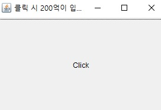
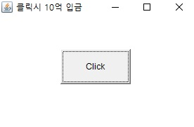

## <a href = "../../README.md" target="_blank">AWT와 애플릿 (AWT & Applet)</a>

### 2. AWT의 주요 컴포넌트
#### 2.2 Button
1. Button
2. Button의 메서드들

---

# 2.2 Button

## 1) Button
사용자가 클릭 시, 어떤 작업이 수행되도록 할 때 사용

---

## 2) Button의 메서드들
1. 생성자
   - Button(String label) : 지정한 lable을 가진 Button 생성
     - label : button 위에 나타날 text
2. 라벨
   - String getLabel() : Button에 나타나있는 text(라벨)을 얻어옴
   - void setLabel(String label) : Button에 나타나있는 text(라벨)을 변경

---

## \[예제\]
### 예제 1>
```
import java.awt.*;

public class ButtonTest {
    public static void main(String[] args) {
        Frame frame = new Frame("클릭 시 200억이 입금됨");
        frame.setSize(300, 200); // frame의 사이즈를 지정

        Button button = new Button("Click");
        button.setSize(100,50); // button의 사이즈를 지정

        frame.add(button); // frame에 button을 추가
        frame.setVisible(true); // frame을 화면에 표시
    }
}
```

- Frame, Button을 생성하고 Button을 Frame에 속하게 함
- Button의 크기를 지정했음에도 버튼이 frame에 꽉 차있음.
  - Frame은 기본적으로 LayoutManager가 BorderLayout으로 설정되어있음.
  - Frame의 LayoutManager에 의해 컨테이너에 속한 컴포넌트의 크기, 위치가 자동적으로 관리됨
  - Visual Basic과 같은 기존의 GUI 프로그래밍에서는 LayoutManager 개념이 없어서, 윈도우 크기가 변경될 때 컴포넌트들을 재배치하는 코드를 개발자가 별도로 작성해야함.
- Button이 눌러졌을 때 수행해야할 코드가 작성되지 않아서 클릭 시 아무 일도 발생하지 않음. (이벤트 처리 필요)
### 예제 2>
```
import java.awt.*;

public class ButtonTest2 {
    public static void main(String[] args) {
        Frame frame = new Frame("클릭시 10억 입금");
        final int FRAME_WIDTH = 300;
        final int FRAME_HEIGHT = 200;
        frame.setSize(FRAME_WIDTH,FRAME_HEIGHT);
        frame.setLayout(null); // LayoutManager를 null로 설정해준다.

        Button button = new Button("Click");
        final int BUTTON_WIDTH = 100;
        final int BUTTON_HEIGHT = 50;
        button.setSize(BUTTON_WIDTH,BUTTON_HEIGHT); // button의 사이즈를 지정

        final int BUTTON_X = FRAME_WIDTH/2 - BUTTON_WIDTH/2;
        final int BUTTON_Y = FRAME_HEIGHT/2 - BUTTON_HEIGHT/2;
        button.setLocation(BUTTON_X,BUTTON_Y); // button의 위치를 지정

        frame.add(button);
        frame.setVisible(true);

    }
}
```
  
- seyLayout(null)을 통해, Frame에 아무런 레이아웃매니저를 지정되어있지 않게 함
    - Frame의 크기를 변경하더라도 Button의 크기, 위치에 변화가 없음
    - Button의 크기, 위치를 수동 지정하였을 때 지정된 초기 위치에 지정된 크기로 계속 존재함.
- Button이 눌러졌을 때 수행해야할 코드가 작성되지 않아서 클릭 시 아무 일도 발생하지 않음. (이벤트 처리 필요)

---