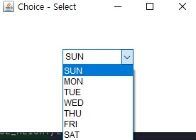

## <a href = "../../README.md" target="_blank">AWT와 애플릿(AWT & Applet)</a>

### 2. AWT의 주요 컴포넌트
#### 2.3 Choice
1) Choice
2) Choice의 메서드들

---

# 2.3 Choice

## 1) Choice
여러 개의 item이 있는 목록을 보여주고, 그 중에서 한 가지를 선택할 때 Choice를 사용한다.
- 기존의 GUI 프로그래밍에서는 Combo box 또는 Drop-down listbox라고 부른다.

## 2) Choice의 메서드들
1. item 추가
   - void add(String item) : Choice에 item 추가
   - void insert(String item, int index) : 지정 index에 item을 추가한다.
2. item 반환
   - String getItem(int index) : 지정 index에 위치한 item 반환
   - String getSelectedItem() : 현재 선택되어져 있는 item을 얻는다.
3. item 제거
   - void remove(String item) : Choice에서 item을 제거
   - void remove(int index) : Choice에서 지정 index에 위치한 item 제거
   - void removeAll() : Choice에서 모든 item 제거
4. 기타
   - int getSelectedIndex() : 현재 선택되어져 있는 item의 index 값 반환
   - int getItemCount() : 현재 Choice에 추가되어 있는 item의 갯수를 반환함

---

## \[예제\]
```
import java.awt.*;

public class ChoiceTest {
    public static void main(String[] args) {
        Frame frame = new Frame("Choice - Select");

        final int FRAME_WIDTH = 300;
        final int FRAME_HEIGHT = 200;

        frame.setSize(FRAME_WIDTH, FRAME_HEIGHT);
        frame.setLayout(null); // LayoutManager을 설정하지 않음.

        Choice day = new Choice(); // choice 생성
        day.add("SUN"); // Choice에 item들 추가
        day.add("MON");
        day.add("TUE");
        day.add("WED");
        day.add("THU");
        day.add("FRI");
        day.add("SAT");

        final int CHOICE_WIDTH = 100;
        final int CHOICE_HEIGHT = 50;

        day.setSize(CHOICE_WIDTH, CHOICE_HEIGHT); // Choice의 크기 지정

        final int CHOICE_X = FRAME_WIDTH/2 - CHOICE_WIDTH/2;
        final int CHOICE_Y = FRAME_HEIGHT/2 - CHOICE_HEIGHT/2;

        day.setLocation(CHOICE_X, CHOICE_Y); // Choice의 좌표 지정

        frame.add(day); // Frame에 Choice 추가
        frame.setVisible(true); // Frame을 화면에 보이게 함
    }
}
```

- add()를 사용하여, Choice에 순서대로 item을 추가함.
- 화살표를 클릭시 추가 항목들이 순서대로 나타남
- ---