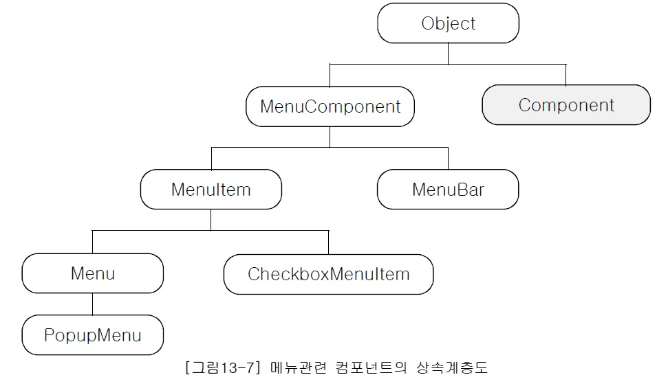
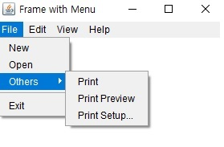
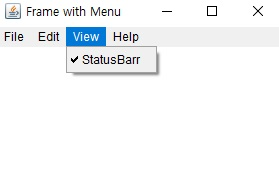

## <a href = "../../README.md" target="_blank">AWT와 애플릿(AWT & Applet)</a>

### 4. 메뉴 만들기
#### 4.1 메뉴를 구성하는 컴포넌트
1) MenuComponent와 그 하위클래스들
2) 메뉴 구성하기
3) 메뉴 관련 컴포넌트들의 메서드들
---

# 4.1 메뉴를 구성하는 컴포넌트
## 1) MenuComponent와 그 하위 클래스들


- MenuComponent : 모든 메뉴 관련 컴포넌트들의 상위 클래스
- MenuBar : Frame에 고정적으로 달아두는 메뉴바 컴포넌트
- Menu : 하위 Menu 또는 MenuItem을 포함시킬 수 있음.
- CheckMenuItem : 메뉴를 클릭할 때마다 메뉴 앞에 체크 표시가 설정되거나 해제됨 
- MenuItem : 항목
- PopupMenu : 프레임에 고정되어 있는 Menubar와 달리, 우클릭으로 호출할 수 있는 메뉴

---

## 2) 메뉴 구성하기
- MenuBar 하위에 Menu를 삽입할 수 있음.
- Menu에는 하위 Menu 또는 MenuItem(항목)을 포함시킬 수 있음.
  - 계층형 메뉴 구성 가능.

---

## 3) 메뉴 관련 컴포넌트들의 메서드들
1. Frame
   - void setMenuBar(Menubar mb) : Frame에 지정 MenuBar를 포함시킨다.
2. MenuBar
   - void setHelpMenu(Menu menu) : 지정 menu를 Help Menu로 지정하여 포함시킨다.
3. Menu
  - void addSeparator() : Menu에 분리선(Separator)을 추가
3. CheckboxMenuItem 생성자
   - CheckboxMenuItem(String name)
   - CheckboxMenuItem(String name, boolean status)
     - name : 보여질 menu 이름
     - status : true이면 체크된 상태로 생성됨. status를 지정하지 않으면 false로 간주(체크 안 됨)
---

## \[예제\]
```
import java.awt.*;

public class MenuTest {
    public static void main(String[] args) {

        Frame frame = new Frame("Frame with Menu"); // 프레임 생성
        frame.setSize(300,200);

        MenuBar menuBar = new MenuBar(); // 메뉴바 생성

        //menu_File 및 그 하위 MenuItem, Menu 생성
        Menu menu_File = new Menu("File");
        MenuItem menuItem_New = new MenuItem("New");
        MenuItem menuItem_Open = new MenuItem("Open");
        Menu subMenu_Others = new Menu("Others");
        MenuItem menuItem_Exit = new MenuItem("Exit");

        // menu_File에 하위 MenuItem 및 Menu 추가
        menu_File.add(menuItem_New);
        menu_File.add(menuItem_Open);
        menu_File.add(subMenu_Others);
        menu_File.addSeparator(); // 메뉴에 분리선을 추가함.
        menu_File.add(menuItem_Exit);

        // subMenu_Others에 추가할 하위 Menu 및 MenuItem 생성 및 추가
        MenuItem menuItem_Print = new MenuItem("Print");
        MenuItem menuItem_Preview = new MenuItem("Print Preview");
        MenuItem menuItem_Setup = new MenuItem("Print Setup...");
        subMenu_Others.add(menuItem_Print);
        subMenu_Others.add(menuItem_Preview);
        subMenu_Others.add(menuItem_Setup);

        //MenuBar에 달아줄 다른 메뉴들도 추가
        Menu menu_Edit = new Menu("Edit");
        Menu menu_View = new Menu("View");
        Menu menu_Help = new Menu("Help");

        //menu_View에 CheckBoxMenuItem 생성, 추가
        CheckboxMenuItem menuItem_StatusBar = new CheckboxMenuItem("StatusBarr");
        menu_View.add(menuItem_StatusBar);

        //menuBar에 메뉴들을 추가
        menuBar.add(menu_File);
        menuBar.add(menu_Edit);
        menuBar.add(menu_View);
        menuBar.setHelpMenu(menu_Help); // 인자로 넘겨받은 메뉴를 Help menu로 지정한다.

        frame.setMenuBar(menuBar); // Frame에 지정 MenuBar를 포함한다.
        frame.setVisible(true); // 화면에 표시

    }
}
```
 
- Frame에 포함시킬 메뉴바
- 메뉴바에 바로 달아줄 최상위 메뉴들 File, Edit, View, Help
- File에는 하위 MenuItem(New, Open, Others) 및 Menu(Others)를 달아줌.
  - Others에는 하위 MenuItem들을 달아줌. (Print, Print Preview, Print Setup, ...)
- View에는 CheckboxMenuItem을 달아줌.
