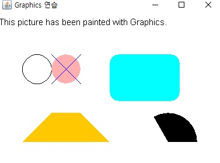

## <a href = "../../README.md" target="_blank">AWT와 애플릿(AWT & Applet)</a>

### 7. AWT의 그래픽
#### 7.1 paint()와 Graphics
1) paint()
2) Graphics
3) Graphics의 메서드들

---

# 7.1 paint()와 Graphics
## 1) paint()
- 컴포넌트에 그림을 그리기 위한 메서드. Component 클래스(및 그 자손 frame, Canvas, Panel,...)에 정의되어 있다. 그림을 그리고자 하는 컴포넌트의 paint()를 오버라이딩하여 사용하면 됨.
    ```
    public void paint(Graphics g) {
    
        ...(실행 내용)
            
    }
    ```
- paint 메서드는 추상클래스 Graphics의 구현체를 인자로 하여, 구현된 다양한 그래픽 메서드를 이용하여 그림을 그리게 된다.

---

## 2) Graphics 
- 모든 컴포넌트는 Graphics의 구현체 객체를 갖고 있으며, Graphics 객체에는 각 컴포넌트의 그래픽 관련 정보가 담겨있다.
- 사용법
  - 컴포넌트의 getGraphics() 를 호출하여, 컴포넌트의 Graphics 객체에 대한 참조를 얻어내, Graphics에 정의된 그래픽 메서드를 이용하여 작업
    ```
    Panel panel = new Panel();
    Graphics panel_Graphics = panel.getGraphics();
    panel_Graphics.drawLine(0,0,10,10); // 두 점 (0,0),(10,10)을 잇는 선을 그린다.
    ```
---

## 3) Graphics의 메서드들
1. 문자 출력 관련 메서드  
문자열을 출력할 수 있으며, 출력할 문자열의 폰트(Font)를 지정할 수 있다.
   - void drawString(String str, int x, int y) : 지정 (x,y)위치에 문자열을 출력한다.
   - void setFont(Font f) : Font를 지정(출력할 폰트 지정)
   - Font getFont() : 지정되어 있는 Font를 반환받음
   - FontMetrics getFontMetrics() : FontMetrics 객체를 반환받는다.
     - FontMetrics : 지정된 폰트에 대한 상세한 정보를 제공
  

2. 색과 관련된 메서드  
출력할 그림의 색을 지정하거나, 지정된 색의 정보를 반환받음.
   - void setColor(Color c) : 출력할 색 지정
   - Color getColor() : 현재 설정되어 있는 Color를 얻는다.


3. 도형과 관련된 메서드  
`draw` 메서드들은 도형의 선만 그리고 `fill` 메서드들은 도형의 내부를 선의 색으로 채움
   - 선을 그리는 메서드
     - void drawLine(int x1, int y1, int x2, int y2) : 두 점 (x1, y1), (x2, y2)를 잇는 선을 그린다.
   - 타원을 그리는 메서드
     - void drawOval(int x, int y, int width, int height)
     - void fillOval(int x, int y, int width, int height)
   - 사각형을 그리는 메서드
     - void drawRect(int x, int y, int width, int height)
     - void fillRect(int x, int y, int width, int height)
   - 둥근 사각형을 그리는 메서드
     - void drawRoundRect(int x, int y, int width, int height, int arcWidth, int arcHeight)
     - void fillRoundRect(int x, int y, int width, int height, int arcWidth, int arcHeight)
   - 입체 사각형을 그리는 메서드
     - void draw3DRect(int x, int y, int width, int height, boolean raised)
     - void fill3DRect(int x, int y, int width, int height, boolean raised)
   - 호를 그리는 메서드
     - void drawArc(int x, int y, int width, int height, int startAngle, int arcAngle)
     - void fillArc(int x, int y, int width, int height, int startAngle, int arcAngle)
   - 다각형을 그리는 메서드
     - void drawPolygon(int[] xPoints, int[] yPoints, int nPoints)
     - void fillPolygon(int[] xPoints, int[] yPoints, int nPoints)
     - void drawPolyLine(int[] xPoints, int[] yPoints, int nPoints)


4. 기타
   - void clearRect(int x, int y, int width, int height) : 지정 영역(사각형)을 지운다.
   - boolean drawImage(Image img, int x, int y, ImageObserver observer) : (x,y)의 위치에 이미지를 그린다.

---

## \[예제\]
```
import java.awt.*;
import java.awt.event.WindowAdapter;
import java.awt.event.WindowEvent;

public class Main {

    public static void main(String[] args) {

        MyFrame myFrame = new MyFrame("Graphics 연습");

    }

}

class MyFrame extends Frame {

    // 생성자
    public MyFrame(String title) {
        super(title);
        addWindowListener(new WindowAdapter() { // 창을 닫았을 때 프로그램이 종료되는 이벤트 리스너를 추가
            @Override
            public void windowClosing(WindowEvent we) {
                System.exit(0);
            }
        }
        );
        setBounds(100,100, 400,300);
        // setSize(400, 300);
        // setLocation(100, 100);
        setVisible(true);
    }

    @Override
    public void paint(Graphics g) {
        g.setFont(new Font("SansSerif", Font.PLAIN, 15));
        g.drawString("This picture has been painted with Graphics.", 10, 50);

        g.drawOval(50, 100, 50, 50);
        g.setColor(Color.pink);
        g.fillOval(100,100, 50,50);

        g.setColor(Color.blue);
        g.drawLine(100,100, 150, 150);
        g.drawLine(150,100,100,150);

        g.setColor(Color.CYAN);
        g.fillRoundRect(200,100,120,80,30,30);

        g.setColor(Color.orange);
        g.fillPolygon(new int[]{50,100,150,200}, new int[]{250,200,200,250},4);

        g.setColor(Color.black);
        g.fillArc(250, 200, 100, 100, 0, 120);
    }
}
```


