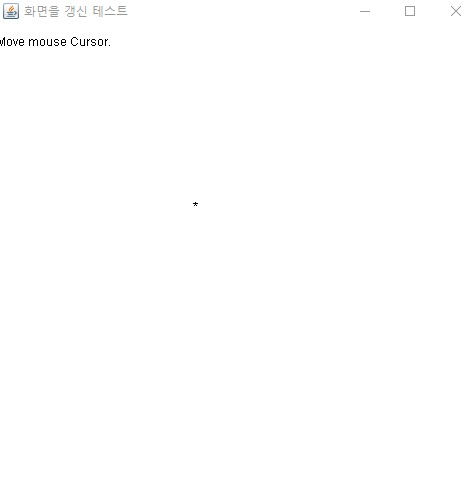
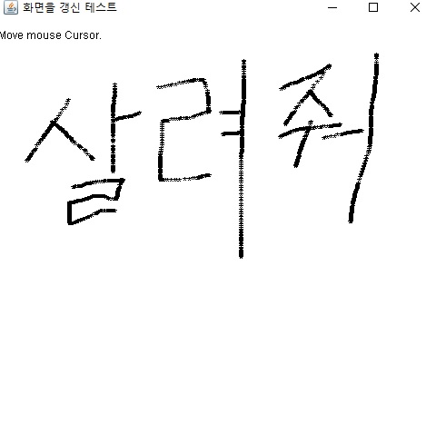

## <a href = "../../README.md" target="_blank">AWT와 애플릿(AWT & Applet)</a>

### 7. AWT의 그래픽
#### 7.2 AWT 쓰레드와 repaint()
1) AWT 쓰레드
2) AWT 쓰레드의 화면갱신 조건
3) repaint()
4) update(Graphics g)
5) 화면 갱신 과정
---

# 7.2 AWT 쓰레드와 repaint()

## 1) AWT 쓰레드
- GUI 어플리케이션을 실행하면, 자동으로 생성되는 데몬쓰레드
- 평소에 대기상태에 있다가, 화면이 갱신되어야할 상황이 발생하면 `paint(Graphics g)` 또는 `update(Graphics g)`를 호출해서 화면이 다시 그려지도록 함.

---

## 2) AWT 쓰레드의 화면갱신 조건
별도로 paint()메서드를 호출하지 않아도, AWT 쓰레드는 자동으로 다음 상황에서 화면을 갱신시키는 메서드를 호출한다.

- 처음 화면에 나타날 때
- 다른 화면에 가려져 있던 부분이 다시 화면에 나타날 때
- 아이콘화 되어 있다가 원래 크기로 화면에 나타날 때
- repaint() 메서드의 요청을 확인했을 때

## 3) repaint()
- AWT 쓰레드에게 화면을 다시 그릴 것을 요청함
- AWT 쓰레드는 0.1초마다 repaint() 요청이 있는지 확인하여, 요청이 있으면 update(Graphics g)를 호출함

## 4) update(Graphics g)
- 화면을 지움
- paint(Graphics g)를 호출함.

---

## 5) 화면 갱신 과정

- repaint() 요청
- AWT 쓰레드의 요청 확인(0.1초마다), 요청이 있으면 update(Graphics g) 호출
- update(Graphics g) : 화면을 지우고 paint(Graphics g) 호출
- paint(Graphics g)의 작업 수행

---

## \[예제\]

```
import java.awt.*;
import java.awt.event.MouseEvent;
import java.awt.event.MouseMotionListener;
import java.awt.event.WindowAdapter;
import java.awt.event.WindowEvent;

public class Main {
    public static void main(String[] args) {
        MyFrame myFrame = new MyFrame("화면을 갱신 테스트");
    }

}

class MyFrame extends Frame implements MouseMotionListener {

    private int x = 0;
    private int y = 0;

    public MyFrame(String title) {
        super(title);
        addMouseMotionListener(this);
        addWindowListener(new WindowAdapter() {
            @Override
            public void windowClosing(WindowEvent we) {
                System.exit(0);
            }
        });
        setBounds(100,100, 500, 500);
        setVisible(true);
    }

    @Override
    public void paint(Graphics g) {
        g.drawString("Move mouse Cursor.", 10, 50);
        g.drawString("*", this.x, this.y);
    }

    @Override
    public void mouseDragged(MouseEvent me) {

    }

    @Override
    public void mouseMoved(MouseEvent me) {
        // 마우스 이동이 감지되면, 이동한 x,y 좌표를 멤버변수에 반영시킨 뒤 repain()를 호출한다.
        this.x = me.getX();
        this.y = me.getY();
        repaint();
    }
}
```

- MouseMotionListener 추가
  - 마우스 이동이 감지되면 이동한 x,y 좌표를 멤버변수에 반영시키고 repaint() 메서드를 호출함
- repaint() - update(Graphics g) - paint(Graphics g)
  - paint(Graphics g) : 문자 메시지를 출력하는 기능과, 멤버의 x,y에 문자 "*"을 띄움

```
    @Override
    public void update(Graphics g) {
        paint(g);
    }
```

- 이 때 update(Graphics g) 메서드를 위와 같이 오버라이드 하면, repaint() 메서드에 의한 호출 시, 화면을 지우는 작업을 수행하지 않게 된다.
- 마우스를 이동시 마우스의 잔상이 화면에 남게 된다.

---