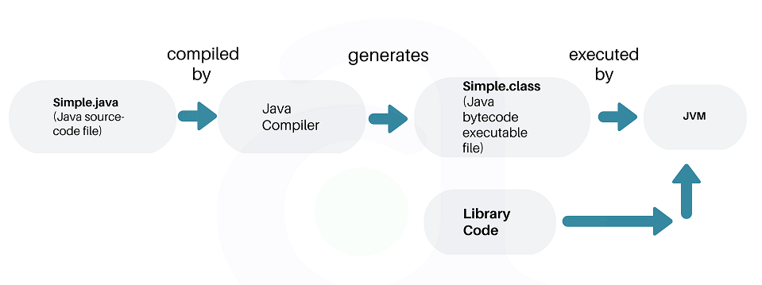
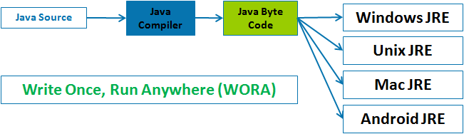

## <a href = "../../README.md" target="_blank">Basics in Java</a>

### 2. Java 개발환경 구축
#### 2.3 Java 어플리케이션의 작성 및 실행
1) Java 어플리케이션 작성하기
2) Java 컴파일
3) Java 어플리케이션의 실행

---

# 2.3 Java 어플리케이션의 작성 및 실행

---

## 1) Java 어플리케이션 작성하기
- notepad, 메모장과 같은 단순한 텍스트 편집기를 통해 날코딩을 하거나,
- Eclipse, IntelliJ Idea와 같은 IDE(통합개발환경, Integrated Development Environment)로 java파일 작성
- IntelliJ를 설치할 것을 권장

---

## 2) Java 컴파일

1. 컴파일 : 어떤 언어로 작성된 코드를 다른 언어로 바꾸는 과정
    - C, C++ 등 고급언어의 컴파일러 : 기계어로 바로 변경. OS마다 다른 기계어 코드를 생성.
    - java : 다양한 플랫폼에서 실행되도록 하기 위해서(OS별 JRE 및 JVM), 중간 언어인 java 바이트코드로 컴파일함.

2. 바이트코드 : 가상머신이 이해할 수 있는 중간코드. 

3. `javac.exe` : 인간이 작성한 `.java`파일을 jvm이 이해할 수 있는 바이트 코드로 컴파일
   - 구문체크
   - 소스코드 최적화
   - 생략된 코드 추가
   - 코드파일에 포함된 클래스들을 `.class`로 분리 컴파일

---

## 3) Java 어플리케이션의 실행
- 한 번 `.Class`파일로 컴파일하면, 어느 플랫폼이든 그에 맞게 제공되는 JRE의 JVM을 통하여 실행할 수 있다.
  - 이러한 특성을 Write Once, Run Anywhere라고 함.
- `javac.exe` :  각 jre의 자바 실행기. JVM을 구동하여 `.class` 파일
- jvm은 바이트코드를 각 OS에 특화된 코드로 변환(인터프리터, JIT 컴파일러)하여 실행한다.

---

참고자료 : HowToDoInJava - <a href="https://howtodoinjava.com/java/basics/jdk-jre-jvm/" target="_blank">Java JDK, JRE and JVM</a>

---