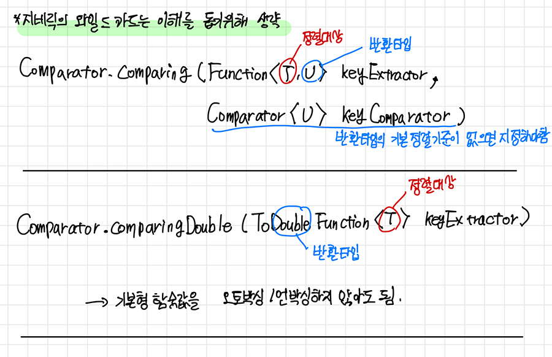

## <a href = "../../README.md" target="_blank">Collection Framework</a>

### 6. 정렬
#### 6.2 interface Comparator\<T>
1) interface Comparator\<T>
2) int compare(T o1, T o2);
3) 람다식으로 Comparator\<T> 표현하기
4) 여러가지 static 메서드
5) 여러가지 default 메서드
6) 유용한 Comparator 상수
---

# 6.2 interface Comparator\<T>

## 1) interface Comparator\<T>
```
@FunctionalInterface
public interface Comparator<T> {
    ...
}
```
- FQCN : java.util.Comparator
- 사용자 정의 정렬기준을 구현하는데 사용되는 인터페이스.
- int compare(T o1, T o2)를 구현해야함.
- JDK 1.8 이후 여러가지 자주 사용되는 default 메서드, static 메서드들이 추가됨. (특히 Stream 관련 메서드들을 주의깊게 보자.)

---

## 2) int compare(T o1, T o2);
```
    int compare(T o1, T o2);
```
- 사용자 정의 정렬기준을 지정하기 위해 사용되는 인스턴스 메서드
- 인자 : 비교 대상이 되는 두 인스턴스
- 반환값(return value)의 부호에 따라 정렬 우선 순위가 결정된다.
  - 음수 : 첫번째 인자가 앞에 정렬됨.
  - 0 : 정렬 순위가 같다.
  - 양수 : 첫번재 인자가 뒤에 정렬됨.

---

## 3) 람다식으로 Comparator\<T> 표현하기  
Comparator는 함수형 인터페이스이므로, 람다식 또는 메서드 참조를 통해 구현할 수 있다.
```
List<Developer> developers = inputDevelopers();

//before jdk 1.8 (직접 Comparator 구현체를 생성하여 이를 통하여 정렬)
developers.sort(new Comparator<Developer>() {
        @Override
		public int compare(Developer o1, Developer o2) {
			return o1.getAge().compareTo(o2.getAge());
		}
});

//Lambda
developers.sort((Developer o1, Developer o2)->o1.getAge()-o2.getAge());

//Method Reference
developers.sort(Developer::getAge);
```

---

## 4) 여러가지 static 메서드
1. naturalOrder() : T의 기본 정렬 기준에 대응되는 Comparator<T>를 반환하는 지네릭 메서드. (지네릭 타입 붙여서 호출해야함)
2. reverseOrder() : T의 기본 정렬 기준의 역순에 대응되는 Comparator<T>를 반환하는 지네릭 메서드. (지네릭 타입 붙여서 붙여서 호출해야함)
   ```
   public static <T extends Comparable<? super T>> Comparator<T> naturalOrder()
   public static <T extends Comparable<? super T>> Comparator<T> reverseOrder()
   
   //usage
   Comparator.<String>naturalOrder() : String 기본정렬기준(a,b,c,...)
   Comparator.<Integer>reverseOrder() : Integer 기본정렬기준의 역순(내림차순)
   ```
   
  


3. comparing : 지정한 함수의 함숫값의 기본정렬 기준으로 정렬.
4. comparingInt, comparingLong, comparingDouble : 함숫값이 기본형인경우 사용. 오토박싱/언박싱을 생략하여 성능이 향상됨
   - 기본 정렬 기준이 존재하지 않을 경우 별도의 Comparator를 지정해야한다.
    ```
    public static <T, U> Comparator<T> comparing(
                Function<? super T, ? extends U> keyExtractor,
                Comparator<? super U> keyComparator)
                
    //usage
    Comparator<Person> compareByFirstNames = Comparator.comparing(Person::getFirstName); // 정렬기준으로 getFirstName의 기본 정렬기준이 반환됨
    ```

4. nullsFirst : null이 있다면 T보다 앞에 정렬되도록 하는 Comparator<T>를 반환함
5. nullsLast : null이 있다면 T보다 앞에 정렬되도록 하는 Comparator<T>를 반환함
   ```
        public static <T> Comparator<T> nullsFirst(Comparator<? super T> comparator);
        public static <T> Comparator<T> nullsLast(Comparator<? super T> comparator);
   ```

---

## 5) 여러가지 default 메서드
1. reversed() : 이 Comparator의 역순에 해당하는 Comparator<T>를 반환함
2. thenComparing() : 추가 정렬기준을 덧붙이는데 사용.
   - `Comparator<T>`를 지정하거나
   - Function을 지정하고, 지정 Function의 함숫값의 기본 정렬 기준으로 정렬
3. thenComparingInt, thenComparingLong, thenComparingDouble : 함숫값이 기본형인 경우 사용. 오토박싱/언박싱을 생략하여 성능이 향상됨.
```
default <U> Comparator<T> thenComparing(
        Function<? super T, ? extends U> keyExtractor,
        Comparator<? super U> keyComparator)

Comparator<Student> comp
        = Comparator.comparingInt(Student::getBan) // getBan()의 반환타입(int)의 기본정렬 기준으로 정렬
            .thenComparingInt(Student::getTotalScore) // 그 다음 정렬 기준은 getTotalScore()의 반환타입(int)의 기본정렬 기준
            .thenComparing(Student::getName) // 그 다음 정렬 기준은 getName()의 반환타입(String)의 기본정렬 기준
```
---

## 6) 유용한 Comparator 상수
1. String
   - public static final Comparator\<String> CASE_INSENSITIVE_ORDER : String을 대소문자 구분 안하고 정렬

---