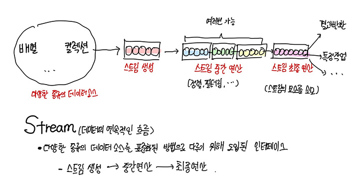

---
## <a href = "../README.md" target="_blank">Lambda & Stream</a>
### 3. Stream
#### 3.1 Stream
1) Stream이란?
2) 기존 데이터군 처리방식의 한계
3) Stream의 편리성
4) Stream을 통한 작업의 흐름
5) Stream의 특징

---

# 3.1 Stream

## 1) Stream이란?


- 데이터의 연속적인 흐름
- 다양한 종류의 데이터 소스를 표준화된 방법으로 다루기 위한 것.

## 2) 기존 데이터군 처리방식의 한계
- 데이터 군을 다루는 인스턴스(컬렉션 프레임웍, 배열)를 생성하기 위해, for문 또는 Iterator 를 이용해서 코드를 작성해왔음.
  - 코드의 가독성이 떨어지고, 재사용성이 떨어짐
- 데이터 군마다 동일한 기능에 대한 처리방법이 각각 다르거나, 동일한 기능을 여러 클래스에 중복정의함
  - 예1) List 정렬 - `Collections.sort()`, Array 정렬 - `Arrays.sort()`
  - 예2) "그 메서드가 여기에 있었나?" 이런 생각 과정을 거침... 이런 생각 과정 자체을 거쳐야하는 것 자체가 비용이다.
  ```
  Integer[] numberArr = {5,4,3,1,2};
  List<Integer> numberList = Arrays.asList(2,4,5,1,3); // 서로 다른 종류의 데이터 소스 (배열, List)
  
  // 데이터 군마다 각기 다른 데이터군 처리법
  Arrays.sort(numberArr); // 배열은 Arrays.sort 메서드()로 정렬
  Collections.sort(numberList); // Collection 인터페이스의 구현클래스들은 Collections.sort() 메서드로 정렬
  
  for(Integer number : numberArr) System.out.println(number); // for문 또는 Iterator문을 길게 작성해서 출력
  for(Integer number : numberArr) System.out.println(number); // for문 또는 Iterator문을 길게 작성해서 출력 
  ```

- 데이터 군의 변경이 발생할 가능성이 있음. 필요에 따라서 데이터군을 매번 다시 생성해야할 수 있다.
  - 예) 정렬을 행하면 데이터의 저장 순서가 변경됨.

---

## 3) Stream의 편리성
- 데이터 소스의 추상화 : 다양한 데이터 소스들에 대하여 표준화된 방식으로 다룰 수 있게 됨. 코드의 재사용성 증가.
  ```
  // 서로 다른 종류의 데이터 소스 (배열, List)
  Integer[] numberArr = {5,4,3,1,2};
  List<Integer> numberList = Arrays.asList(2,4,5,1,3); 
  
  // Stream으로 생성하기만 하면
  Stream<Integer> numberStream1 = Arrays.stream(numberArr);
  Stream<Integer> numberStream2 = numberList.stream(); 
  
  // 그 후의 데이터 군에 대한 처리법이 표준화됨. (정렬, 출력)
  numberStream1.sorted().forEach(System.out::println);
  numberStream2.sorted().forEach(System.out::println); 
  ```

- 데이터를 처리하는데 자주 사용되는 메서드들을 정의
  - 조회, 제거, 필터링, 추가, ...

---

## 4) Stream을 통한 작업의 흐름

- Stream 생성 : 각기 다른 데이터 소스들을 기반으로 Stream 생성
- 중간 연산 : 연산결과가 Stream인 연산. 반복적으로 적용 가능.
  - 예>  
    `distinct()` - 중복 제거, `filter(...)` - 조건에 맞는 요소만 남기기(필터링), limit(...) - 일부만 잘라내기,  
  `skip(...)`-  일부만 건너뛰기, `peek(...)` - 요소에 특정 작업 수행, `sort(...)` - 정렬, `map(...)` - 요소 변환
- 최종 연산 : 연산결과가 Stream이 아닌 연산. 단 한번만 적용 가능. (Stream의 요소를 소모)
  - 필요에 따라 작업 결과를 컬렉션, 배열 등에 담아서 반환 가능
  - 반환값 없이 어떤 작업을 수행하기만 하고 Stream을 소모할 수 있음
  - 예>  
    `forEach(...)` - 각 요소별 지정작업 수행, `count()` - 요소 갯수 반환, `max(...) / min(...)` - 최대/최소,  
  `findAny()` - 아무거나 하나, `findFirst()` - 첫번째 요소, `toArray()` - 배열로 반환,  
  `allMatch(...)/anyMatch(...)/noneMatch(...)` - 주어진 조건에 대한 부합 여부,  
  `reduce()` - 요소를 하나씩 줄여가면서 계산,  
  `collect()` - 요소를 수집(요소 그룹화, 분할 결과를 컬렉션에 담기 위한 용도), ... 

---

## 5) Stream의 특징

1. 데이터 소스를 변경하지 않음. (Read Only)


2. 일회성 : 재사용을 허용하지 않음.
   - 재사용을 하기 위해서는 데이터 소스를 기반으로 다시 Stream을 생성해야한다.
   - 소모된 Stream을 재사용하려 시도하면 Exception이 발생함


3. Stream은 작업을 내부 반복으로 처리한다.
   - for문, iterator문 등 지저분한 데이터 처리 과정이 메서드 내부에 숨겨져 있으며, 이 덕분에 코드가 간결해짐.


4. 다양한 연산 제공 : 여러가지 중간 연산, 최종연산 메서드를 통해 복잡한 작업을 간단히 수행할 수 있음.
   - forEach,count, ...


5. 지연된 연산 : 최종연산이 수행되기 전까지 중간연산이 수행되지 않는다. 중간연산은 단지 어떤 작업이 수행될지를 지정해주는 것이며, 실제 수행은 최종연산 단계에서 수행됨.


6. 기본형 타입에 대한 Stream이 별도로 존재한다. (IntStream, DoubleStream, ...)
   - 오토박싱, 오토 언박싱으로 인한 비효율을 줄이기 위함.
   - 이들 기본형 Stream은 각각 기본형에 대한 유용한 메서드들이 추가적으로 포함되어 있다.


7. 병렬 스트림 : 여러 작업을 병렬로 수행할 수 있음.
   - parallel() : Stream을 병렬 Stream으로 전환
   - `sequential()` : 병렬 Stream화 됐던 것을 다시 원래대로 돌림

---