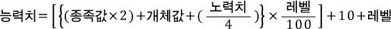
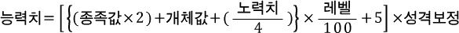

---

# 포켓몬 개체값 계산기

# 1. 어떤 프로그램인가?

## 1) 입력
- 포켓몬의 종, 레벨, 성격, 각 능력치 실제값, 노력치를 입력받는다.

## 2) 출력
- 종족값 및 종족값 총합
- 입력 조건 하에서의 능력치 실제값의 유효 범위
- 개체값의 예상 범위 (최솟값~최댓값)
  - 최솟값과 최댓값이 일치하면 값 하나만 띄움)
  - 유효하지 않을 경우 각 능력치별로 메시지 출력

## 3) 예시
실제 이 기능은 이미 전세계의 많은 포켓몬 유저들이 웹사이트, 여러 프로그램 등을 통해 실제로 구현을 했다.  
**이를 java에서 GUI로 구현하는 것이 이번 목표이다.**

<a href="https://pycosites.com/pkmn/ivcalc.php" target="_blank">실제 예시</a>

---

# 2. 용어 설명

어떤 포켓몬의 능력을 나타내는 정숫값 능력치가 존재한다.
능력치는 Hp, 공격, 방어, 특수공격, 특수방어, 스피드 6가지가 존재한다.
이 능력치의 실제 값은 다음 4가지 요소에 의해 결정된다.

1. 종족값 : <a href="https://pokemon.fandom.com/ko/wiki/%EC%A2%85%EC%A1%B1%EA%B0%92" target="_blank"> 포켓몬위키 종족값 문서</a>
2. 개체값 : <a href="https://pokemon.fandom.com/ko/wiki/%EA%B0%9C%EC%B2%B4%EA%B0%92" target="_blank"> 포켓몬위키 개체값 문서</a>
3. 성격 : <a href="https://pokemon.fandom.com/ko/wiki/%EC%84%B1%EA%B2%A9" target="_blank"> 포켓몬위키 성격 문서</a>
4. 노력치 : <a href="https://pokemon.fandom.com/ko/wiki/%EB%85%B8%EB%A0%A5%EC%B9%98" target="_blank"> 포켓몬위키 노력치 문서</a>
5. 레벨 : <a href="https://pokemon.fandom.com/ko/wiki/%EB%A0%88%EB%B2%A8" target="_blank"> 포켓몬위키 레벨 문서</a>

어떤 포켓몬에 대하여 그 포켓몬의 능력치는 다음과 같이 결정된다.

## HP

## 그 외 모든 능력치 (공격, 방어, 특수공격, 특수방어, 스피드)

---

# 3. 구현 과정 및 작동 원리

Main 메서드에서 Application 객체를 생성하고 run() 메서드를 호출하여 실행한다.
실행이 종료되면 프로그램이 종료된다.

## 기반 데이터
### 1) 종족값 : Species
- 종족별 종족값을 정의한 클래스
- `Stat_table.txt`을 읽어와서, 라인단위로 분리 후 종족값 모음Map인 Map<String, Species> `SPECIES_MAP`에 일괄 추가.
- 생성자에 private 접근제어자를 걸어뒀기 때문에 종족 객체를 더 이상 추가할 수 없다.
- 실제 종족 데이터에 접근하려면 Species.of(종족명)을 통해 접근해야한다. (`SPECIES_MAP`에서 조회)

### 2) 성격 : Nature
- 성격별 능력치 배율을 정의한 클래스
- `Nature_table.txt`를 읽어와서 라인단위로 분리 후 성격 모음Map인 Map<String, Nature> `NATURE_MAP`에 일괄 추가
- 생성자에 private 접근제어자를 걸어뒀기 때문에 성격 객체를 더 이상 추가할 수 없다.
- 실제 성격 데이터에 접근하려면 Nature,of(성격명)을 통해 접근해야한다. (`NATURE_MAP`에서 조회)

---