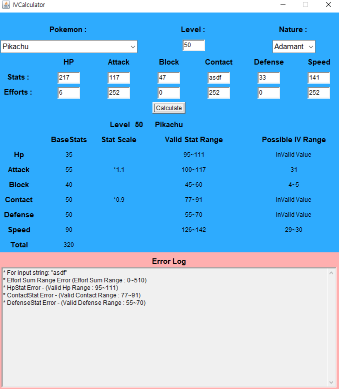

---

# 포켓몬 개체값 계산기

---

# 1. 어떤 프로그램인가?

각 포켓몬 종은 여러가지 조합의 타입을 지닌다. (물, 불, 풀,...)  
또, 각 포켓몬 종별로 스탯의 분포도 다르다.(예 : 쥬피썬더의 스피드 종족값은 130이고, 단단지의 스피드 종족값은 5. 일반적으로 쥬피썬더가 단단지보다 더 빠르다.)

같은 종의 포켓몬을 잡더라도, 같은 레벨의 포켓몬이라도 제각각 능력치가 다르다. 이는 포켓몬 게임 내에서 여러가지 난수에 의해 포켓몬의 여러 능력치 인자값이 서로 다르기 떄문이다.

포켓몬들은 25가지 종류의 성격 중 하나의 성격을 가지고, 각 능력치는 32가지 개체값에 의해 우열이 결정된다. (0이 제일 낮고, 31이 제일 높다.)
결국 유저들은 개체값이 높은 포켓몬들을 잡기 위해 알까기 노가다를 하게 되고, 알을 까서 나온 포켓몬의 능력치가 낮을 경우 이를 버리는(...) 행위를 행하면서 고개체 포켓몬을 잡는 노가다를 계속 하게 됐다.

이 프로그램은 어떤 포켓몬의 종, 실수치와 성격, 그리고 투자한 노력치를 기반으로 하여 개체값의 추정 범위를 알려주는 프로그램이다.

---

실제 이 기능은 이미 전세계의 많은 포켓몬 유저들이 웹사이트, 여러 프로그램 등을 통해 실제로 구현을 했다.  
**이를 java에서 GUI로 구현하는 것이 이번 목표이다.**

<a href="https://pycosites.com/pkmn/ivcalc.php" target="_blank">실제 예시</a>

---

# 2. 용어 설명

어떤 포켓몬의 능력을 나타내는 정숫값 능력치가 존재한다.
능력치는 Hp, 공격, 방어, 특수공격, 특수방어, 스피드 6가지가 존재한다.
이 능력치의 실제 값은 다음 4가지 요소에 의해 결정된다.

1. 종족값 : <a href="https://pokemon.fandom.com/ko/wiki/%EC%A2%85%EC%A1%B1%EA%B0%92" target="_blank"> 포켓몬위키 종족값 문서</a>
2. 개체값 : <a href="https://pokemon.fandom.com/ko/wiki/%EA%B0%9C%EC%B2%B4%EA%B0%92" target="_blank"> 포켓몬위키 개체값 문서</a>
3. 성격 : <a href="https://pokemon.fandom.com/ko/wiki/%EC%84%B1%EA%B2%A9" target="_blank"> 포켓몬위키 성격 문서</a>
4. 노력치 : <a href="https://pokemon.fandom.com/ko/wiki/%EB%85%B8%EB%A0%A5%EC%B9%98" target="_blank"> 포켓몬위키 노력치 문서</a>
5. 레벨 : <a href="https://pokemon.fandom.com/ko/wiki/%EB%A0%88%EB%B2%A8" target="_blank"> 포켓몬위키 레벨 문서</a>

어떤 포켓몬에 대하여 그 포켓몬의 능력치는 다음과 같이 결정된다.

## HP

## 그 외 모든 능력치 (공격, 방어, 특수공격, 특수방어, 스피드)

---

# 3. 상세 내역

## 1) 구동
- Main 메서드에서 Application 객체를 생성하고 open() 메서드를 호출하면 홈화면이 열린다.
  - 홈화면의 닫기버튼을 누르면 창이 닫힌다.
- 홈화면에서 IV Calculator를 실행하면 개체값 계산기 창이 열린다.
  - 개체값 계산기 창을 닫으면 보이지 않게된다.
  - 다시 실행하면 새창이 뜬다. (기존 IV Calculator창은 더 이상 참조되지 않아 GC에서 제거될 것)

## 2) 입력
사용자로부터 인자들을 입력받는다.
  - Pokemon : 포켓몬의 종을 선택하는 부분. Choice로 구현했다.
  - Level : 포켓몬의 레벨을 입력하는 부분. 1~100 사이의 값이 유효범위다.
  - Nature : 포켓몬의 성격을 선택하는 부분. 능력치의 배율을 결정한다. Choice로 구현했다.
  - Stats : 인게임의 실제 능력치값(실수치). 
  - Efforts : 투자한 노력치값. 4로 나눈 몫만큼 실수치에 영향을 끼친다. 각 노력치값은 0~255 값이 유효하며, 노력치의 합은 510을 넘길 수 없다.

## 3) 계산 결과 출력
입력 인자를 바탕으로 다음 정보를 출력한다.
  - Base Stats : 종족값
  - Stat Scale : 입력한 성격에 따른 각 능력치의 배율. 아무것도 보이지 않는 것들은 1배이며, 증가된 능력치는 \*1.1, 감소한 능력치는 \*0.9 로 표시된다.
  - Valid Stat Range : 종족, 성격, 노력치에 기반하여 능력치 값의 유효범위를 출력한다. (개체값 0~31 범위 내에서의 최소, 최대)
  - Possible IV Range : 입력값에 기반하여 각 값의 유효범위를 출력한다. 입력값이 유효하지 않을 경우 'InValidValue'메시지를 출력한다.

## 4) 에러 메시지 출력
사용자의 입력이 유효하지 않을 경우 각 에러의 원인들을 출력한다.

---

## 기반 데이터
### 1) 종족값 : Species
- 종족별 종족값을 정의한 클래스
- `Stat_table.txt`을 읽어와서, 라인단위로 분리 후 종족값 모음Map인 Map<String, Species> `SPECIES_MAP`에 일괄 추가.
- 생성자에 private 접근제어자를 걸어뒀기 때문에 종족 객체를 더 이상 추가할 수 없다.
- 실제 종족 데이터에 접근하려면 Species.of(종족명)을 통해 접근해야한다. (`SPECIES_MAP`에서 조회)

### 2) 성격 : Nature
- 성격별 능력치 배율을 정의한 클래스
- `Nature_table.txt`를 읽어와서 라인단위로 분리 후 성격 모음Map인 Map<String, Nature> `NATURE_MAP`에 일괄 추가
- 생성자에 private 접근제어자를 걸어뒀기 때문에 성격 객체를 더 이상 추가할 수 없다.
- 실제 성격 데이터에 접근하려면 Nature,of(성격명)을 통해 접근해야한다. (`NATURE_MAP`에서 조회)

---

## 구현 후기

- 레이아웃 때문에 몇 일을 날린건가?
- 하드코딩을 하느라 자괴감이 들고 괴롭다. 너무 힘들었다...
- 나는 역시 백엔드가 맞나봐.

---